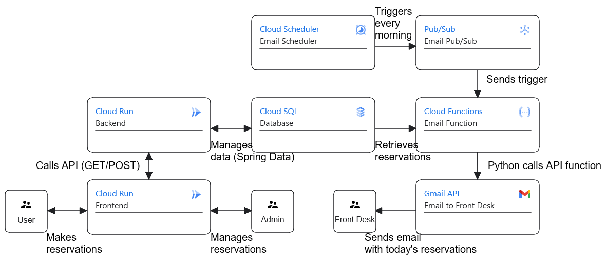

# Google Cloud – Room Reservation
The aim of this project is to create a web app that will allow the user to reserve rooms in a building of a company running the app.

It will make use of the following Google Cloud features:
* Cloud Run – to run the backend and frontend in a serverless environment
* Cloud SQL – to store reservation data
* Cloud Storage – to store photos of rooms uploaded by the admin
* Cloud Logging – to provide logs of attempted reservations
* Cloud Functions – to send a notification to the front desk containing reservation data each morning

C2 Container Diagram:

